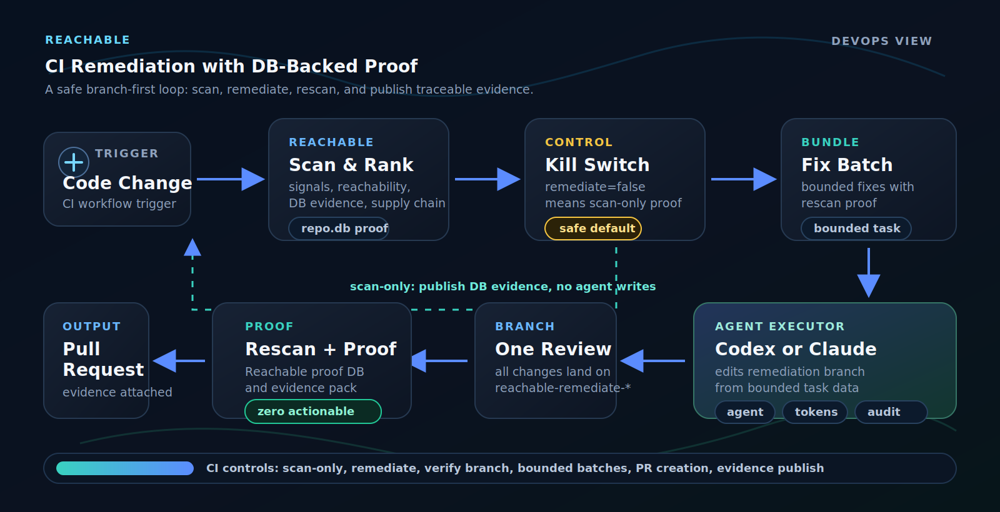

# reach-testbed-go

Intentionally vulnerable Go fixture repository for demonstrating Reachable
CI/CD scanning, agentic remediation, and DB-backed post-fix proof.

> Do not deploy this application. It contains synthetic security issues for
> scanner validation and controlled demos only.

## Release Manager Demo Runbook

The diagram above is the release-gate flow. To run that flow in GitHub Actions,
use this workflow:

[GitHub Actions → Run Demo](https://github.com/sthenos-security/reach-testbed-go/actions/workflows/reachable-remediate.yml)

### Which Action Do I Run?

| Action shown in GitHub | Meaning | Run manually? |
|------------------------|------------------|---------------|
| `Run Demo` | Scan the vulnerable release candidate, create a fix branch, test it, rescan it, open or prepare a PR, and publish the verdict status page. | Yes |
| `Reset Demo` | Delete old `reachable-remediate-*` demo branches before a fresh run. | Optional |
| `pages-build-deployment` | Publish Verdict Status Page. This is GitHub Pages plumbing created automatically after `Run Demo` publishes results. | No |

### Run A Full Fix Demo

Click **Run workflow** and leave the defaults selected. The defaults run the
full release-gate demo: scan `main`, create a remediation branch, run the
agent, run project tests, rescan after each bounded batch, stop when the DB
proof is clean, open a PR, and publish the verdict page.

| Control | Demo value | Release-manager meaning |
|---------|------------|-------------------------|
| Branch | `main` | Start from the intentionally vulnerable release candidate. |
| `remediate` | `true` | Let CI create a fix branch and apply a bounded patch. |
| `rescan_only` | `false` | Run the full release-gate loop: scan baseline, patch branch, run tests, rescan proof, publish evidence. |
| `target_branch` | `main` | The branch being evaluated as the release candidate. |
| `remediation_mode` | `codex-openai` | Uses Codex with `OPENAI_API_KEY`. Use `claude-anthropic` only when validating Claude Code with `ANTHROPIC_API_KEY`. |
| `prompt_profile` | `balanced` | Keeps fixes scoped: enough context to repair the issue queue without turning the run into an open-ended refactor. |
| `signal_types` | `all` | Covers all demo blocker classes: CVE, CWE, secret, DLP, and AI findings. |
| `max_batches` | `5` | Upper bound for serialized fix batches. The workflow stops early as soon as the DB proof is clean. |
| `rescan_strategy` | `each_batch` | Rescan after each bounded patch batch so CI can stop once release blockers are gone. |
| `require_ai` | `true` | Fail fast if the selected AI key is missing, instead of producing a confusing partial run. |
| `fresh_scan` | `false` | Reuse the Reachable cache for speed. Set `true` only when you intentionally want a clean no-cache evidence run. |
| `create_pr` | `true` | Open the reviewable fix PR for the release manager. |
| `run_project_tests` | `true` | Run `go test ./...` after the patch, before the security proof scan. |

Expected result: the workflow creates a `reachable-remediate-*` branch, runs
the project test gate, rescans that branch, and publishes the proof page. If
GitHub accepts CI pull-request creation, the workflow also opens the PR. If
GitHub blocks API PR creation, use the manual fallback below; the remediation
branch and DB-backed proof page are still the evidence.

Automatic PR creation is controlled by CI permissions, not by Reachable scanner
tokens. Branch push, artifact upload, Pages publishing, and SARIF upload use the
built-in `GITHUB_TOKEN`; PR creation uses `CI_PR_TOKEN`, a repository secret
containing a GitHub PAT with Contents, Issues, and Pull requests set to read and
write. Branch protection and review policy still decide whether anything can
merge.

### Manual PR Fallback

Use this if the workflow publishes a clean proof page and pushes the
`reachable-remediate-<run_id>` branch, but GitHub blocks automatic PR creation.

1. Open the repository [Branches page](https://github.com/sthenos-security/reach-testbed-go/branches).
2. Find the latest `reachable-remediate-<run_id>` branch from the successful `Run Demo` log or verdict page.
3. Click **New pull request** for that branch.
4. Confirm `base: main` and `compare: reachable-remediate-<run_id>`.
5. Create the PR and review the code diff together with the DB-backed proof page.

The manual PR is only a review wrapper around the already-published evidence:
the workflow has already pushed the remediation branch, run the project test
gate, rescanned the branch, and published the proof artifacts.

### Run A Scan-Only Evidence Demo

Use this when you want to show detection and reporting without allowing CI to
write a fix branch.

| Control | Demo value | Release-manager meaning |
|---------|------------|-------------------------|
| Branch | `main` | Scan the intentionally vulnerable release candidate. |
| `remediate` | `false` | Do not invoke the coding agent or change code. |
| `rescan_only` | `false` | Run only the baseline scan and evidence publication. |
| `target_branch` | `main` | Branch being evaluated. |
| `require_ai` | `true` | Fail early if AI enrichment cannot run. |
| `fresh_scan` | `false` | Reuse cache for speed unless you are testing a clean no-cache run. |

Expected result: the workflow publishes baseline evidence and blocker counts,
but no remediation branch or PR is created.

### Verify An Existing Fix Branch

Use this after a remediation branch already exists and you only want proof that
the branch is clean.

| Control | Demo value | Release-manager meaning |
|---------|------------|-------------------------|
| Branch | `main` | The workflow definition still runs from `main`. |
| `remediate` | `false` | Do not invoke the coding agent. |
| `rescan_only` | `true` | Only scan and prove the selected branch. |
| `target_branch` | `reachable-remediate-*` | Existing fix branch to verify. |
| `require_ai` | `true` | Keep AI-backed reachability/enrichment enabled. |

Expected result: the workflow scans the selected branch, gates on zero
release blockers, and publishes proof for that branch.

### What A Successful Full Run Proves

| Evidence | Release-manager meaning |
|----------|-------------------------|
| Baseline scan | The release candidate contains the expected blocker queue. |
| Fix branch | CI produced a `reachable-remediate-*` branch instead of changing `main` directly. |
| Project tests | The patch still passes the application test command. |
| Proof scan | Reachable rescanned the fix branch from the database source of truth. |
| Pull request | The fix is ready for normal review and merge policy. |
| Public verdict status page | Sanitized evidence shows baseline findings, fixed findings, branch, commit, scan IDs, timestamps, runtime, AI cost, and artifact links. |

### Actions Menu

| Workflow | Purpose |
|----------|---------|
| `Run Demo` | Main demo workflow. Run this to show the release-gate loop. |
| `Reset Demo` | Deletes old `reachable-remediate-*` branches when resetting the demo. Use `dry_run=true` first if you want to preview. |
| `pages-build-deployment` | Publish Verdict Status Page. This is GitHub Pages plumbing. Do not run it manually; it appears after `Run Demo` publishes results. |

### CI Helper Scripts

The workflow code is [.github/workflows/reachable-remediate.yml](.github/workflows/reachable-remediate.yml).
These helper scripts keep the release-gate logic auditable and testable outside
GitHub Actions:

| Script | Used for | Release-gate purpose |
|--------|----------|----------------------|
| [ci/smoke-db-remediation-proof.py](ci/smoke-db-remediation-proof.py) | Preflight smoke test | Verifies the DB proof/verdict helper can run before the expensive scan begins. |
| [ci/reachable-cache-evidence.py](ci/reachable-cache-evidence.py) | Cache telemetry | Records whether the Reachable cache was restored, reused, or created fresh. |
| [ci/collect-reachable-report.sh](ci/collect-reachable-report.sh) | Artifact collection | Collects the latest Reachable scan outputs into `.reachable/ci-artifacts`. |
| [ci/check-db-release-blockers.py](ci/check-db-release-blockers.py) | Baseline gate | Reads the scan database and checks that the vulnerable branch matches the expected release-blocker contract. |
| [ci/write-remediation-ledger.py](ci/write-remediation-ledger.py) | Remediation audit | Writes a sanitized remediation ledger without publishing prompts, rules, transcripts, or raw databases. |
| [ci/run-agent.sh](ci/run-agent.sh) | Agent execution | Invokes the selected coding agent against the bounded remediation task. |
| [ci/check-db-remediation-proof.py](ci/check-db-remediation-proof.py) | Proof gate | Reads the proof scan database and fails unless release blockers are gone. |
| [ci/sanitize-sarif-for-upload.py](ci/sanitize-sarif-for-upload.py) | Platform export hygiene | Sanitizes the SARIF compatibility export before upload; SARIF is not the source of truth. |
| [ci/build-pages-summary.py](ci/build-pages-summary.py) | Public evidence page | Builds the sanitized Pages report from DB-backed evidence and workflow metadata. |
| [ci/smoke-pages-summary.py](ci/smoke-pages-summary.py) | Page smoke test | Verifies the public summary/page artifacts have the expected structure. |

## Start Here

| Question | Answer |
|----------|--------|
| What is this repo? | A controlled vulnerable Go application used to demonstrate Reachable CI scanning, autonomous remediation, and DB-backed proof that a remediation branch is clean. |
| What do I configure? | Add one AI key as a repository secret: `OPENAI_API_KEY` for `codex-openai` / Codex (OpenAI), or `ANTHROPIC_API_KEY` for `claude-anthropic` / Claude Code (Anthropic). Optional workflow inputs are listed below. |
| How does the PR open? | The workflow uses `CI_PR_TOKEN`, a GitHub PAT stored as a repository secret, for PR creation. Branch protection and reviews still control merge. |
| Where is the CI pipeline? | [.github/workflows/reachable-remediate.yml](.github/workflows/reachable-remediate.yml). That workflow scans, optionally remediates, rescans, verifies the DB proof, and publishes sanitized evidence. |
| Where do I run it? | GitHub Actions → [Run Demo](https://github.com/sthenos-security/reach-testbed-go/actions/workflows/reachable-remediate.yml). |
| Where are the verdict and artifacts? | [Public verdict status page](https://sthenos-security.github.io/reach-testbed-go/) and [published artifacts](https://sthenos-security.github.io/reach-testbed-go/#artifacts). |
| What is the expected vulnerable contract? | [EXPECTED.md](EXPECTED.md) and [expected/baseline.json](expected/baseline.json). |

## Demo Verdict

The public demo page is the release-facing proof view for the last published
successful proof:

<https://sthenos-security.github.io/reach-testbed-go/>

That page is built from Reachable scan evidence. It shows the branch, commit,
scan ID, and CI run it came from. The GitHub Actions workflow list remains the
authority for the latest run status. It shows:

| Evidence | What the viewer should understand |
|----------|-------------------------------------|
| Vulnerable baseline | The known vulnerable `main` branch was scanned and matched the expected issue contract. |
| Remediation branch | CI created a reviewable remediation branch and applied the agent fixes there. |
| Proof scan | Reachable rescanned the remediated branch and compared the result to the expected contract. |
| Final verdict | The demo passes only when the proof database has zero release blockers. |
| Audit metadata | Branch, commit, scan number, timestamp, runtime, AI token count, and estimated AI cost are displayed for traceability. |
| Sanitized artifacts | Convenience exports are linked for review; private prompts, rules, agent transcripts, raw witnesses, and local databases are not published. |

The scan database is the source of truth for the demo verdict. SARIF may be
generated for platform compatibility, but it is only an export report. It is
not the authority for the pass/fail claim.

## CI Validation Flow

The workflow in [.github/workflows/reachable-remediate.yml](.github/workflows/reachable-remediate.yml)
is the implementation. At a high level, each demo run follows this sequence:

1. CI checks out the vulnerable baseline branch.
2. Reachable installs or updates, records cache evidence, and scans the
   baseline into `repo.db`.
3. The baseline database is compared with [expected/baseline.json](expected/baseline.json).
   A mismatch fails the run because the testbed contract is no longer intact.
4. Reachable synthesizes a bounded remediation request from the database.
5. The selected coding agent edits a dedicated `reachable-remediate-*` branch.
6. The project test command runs to catch ordinary build or behavior breaks.
7. Reachable rescans the remediation branch into a new proof database.
8. If the proof database still has release blockers, CI generates another
   bounded batch from the updated database state, up to `max_batches`.
9. The proof database is compared with the expected contract. The pass
   condition is zero remaining release blockers. Rescan-only verification uses
   the same database release-blocker gate; SARIF is never the pass/fail source.
10. CI publishes a sanitized Pages report and support artifacts with the exact
   scan IDs, branch names, commits, timestamps, runtime, cache state, and AI
   cost telemetry.

This is branch-first by design. The tool fixes code on a remediation branch so
a release manager can inspect the diff, verify the proof, and merge only after
normal review.

## Expected Findings

The expected vulnerable contract is documented in [EXPECTED.md](EXPECTED.md)
and enforced by [expected/baseline.json](expected/baseline.json).

Current golden baseline:

| Result | Expected |
|--------|----------|
| Raw DB signals | 28 |
| Release blockers before remediation | 18 |
| DB evidence rows used in public proof | 21 |
| Families | CVE, CWE, secret, DLP, AI |
| Grouped expected findings | 17 grouped findings covering 28 raw DB signals. |
| Release blockers after remediation | 0 non-deferred blockers |
| Deferred demo case | `GO-CWE-01` / `CWE/78` at `internal/handlers/cwe.go:12`; kept in the scanner contract, skipped from autonomous-remediation proof until the agent prompt is tightened. |
| Residual post-fix findings | Only filtered `NON_PROD` or `NOT_REACHABLE` fixture markers may remain in the database. |

The testbed itself is the contract. Do not edit the vulnerable fixture or the
expected manifest just to make a scan pass; scanner logic must conform to the
golden behavior.

## Published Artifacts

The Pages report links a small set of public artifacts. These are review aids,
not private execution material.

| Artifact | Purpose |
|----------|---------|
| [summary.json](https://sthenos-security.github.io/reach-testbed-go/summary.json) | Compact DB-backed run summary for the public page. |
| [db-remediation-verdict.json](https://sthenos-security.github.io/reach-testbed-go/db-remediation-verdict.json) | Machine-readable baseline/proof comparison and final verdict. |
| [reachable.sarif](https://sthenos-security.github.io/reach-testbed-go/reachable.sarif) | Compatibility export for GitHub Code Scanning; not the demo verdict source. |
| [remediation-ledger.json](https://sthenos-security.github.io/reach-testbed-go/remediation-ledger.json) | Sanitized remediation summary with rule IDs and outcomes, not prompt text. |
| [compliance.json](https://sthenos-security.github.io/reach-testbed-go/compliance.json) | DB-backed compliance evidence extract. |
| [compliance-narrative.json](https://sthenos-security.github.io/reach-testbed-go/compliance-narrative.json) | Evidence-cited narrative draft for review, not a legal attestation. |
| [expected-results.html](https://sthenos-security.github.io/reach-testbed-go/expected-results.html) | Branded expected issue contract and baseline proof criteria. |

The workflow must not publish raw remediation bundles, prompt text, generated
rule packs, skills databases, fuzz or pentest prompts, agent transcripts, raw
witness payloads, or local `repo.db` files.

## Agent Lanes And Workflow Inputs

The demo supports two simple CI lanes:

| Lane | Secret | Agent |
|------|--------|-------|
| `codex-openai` | `OPENAI_API_KEY` | Codex (OpenAI) |
| `claude-anthropic` | `ANTHROPIC_API_KEY` | Claude Code (Anthropic) |

The workflow inputs are the operational guardrails. They define whether the
run only scans, creates a remediation branch, verifies an existing branch, or
publishes fresh evidence.

| Input | Default | Purpose |
|-------|---------|---------|
| `remediate` | `true` | Main kill switch. When false, CI scans and publishes evidence without changing code. |
| `rescan_only` | `false` | Verifies `target_branch` as an existing branch; does not invoke an agent or create edits. |
| `target_branch` | `main` | Baseline branch for normal runs, or the branch to verify when `rescan_only=true`. |
| `remediation_mode` | `codex-openai` | Selects the agent lane and matching provider secret. |
| `prompt_profile` | `balanced` | Controls how aggressively Reachable bundles remediation work. |
| `signal_types` | `all` | Limits remediation to selected signal families, or leaves all families eligible. |
| `max_batches` | `5` | Bounds the number of serialized agent remediation batches. CI stops early when the DB proof is clean. |
| `rescan_strategy` | `each_batch` | Runs proof scans after each batch so the workflow can stop as soon as the branch is clean. |
| `scan_extra_flags` | empty | Optional extra scan flags for advanced test runs. |
| `require_ai` | `true` | Fails early unless the selected provider key is configured. |
| `fresh_scan` | `false` | Starts from an empty `~/.reachable` cache for a clean evidence run. |
| `create_pr` | `true` | Opens a remediation pull request when code changes are successfully produced. |
| `run_project_tests` | `true` | Runs the repository safety gate before proof scans. |
| `project_test_command` | `go test ./...` | Command used for the post-agent safety gate. |

The public report should make the selected branch, commit, scan number, final
proof state, cache state, and artifact links obvious without requiring the
viewer to know these inputs.

## Repository Layout

| Path | Purpose |
|------|---------|
| [cmd/server/](cmd/server/) | HTTP entrypoint and route registration. |
| [internal/handlers/](internal/handlers/) | Vulnerable, defended, and assessed signal cases. |
| [internal/safety/](internal/safety/) | Guard helpers used by defended cases. |
| [config/](config/) | Synthetic insecure configuration cases. |
| [deploy/](deploy/) | Synthetic IaC cases. |
| [testdata/dlp/](testdata/dlp/) | Synthetic DLP corpus. |
| [expected/baseline.json](expected/baseline.json) | Machine-readable expected scanner contract. |
| [ci/](ci/) | DB proof, page summary, and CI helper scripts. |
| [docs/](docs/) | Public demo page assets and sanitized reports. |
| [.github/workflows/](.github/workflows/) | Demo scan/remediation/proof publishing workflow and branch cleanup workflow. |

## What “Fixed” Means

For this demo, “fixed” means:

1. The vulnerable baseline database contained the expected issue.
2. The remediation branch proof database no longer contains that production
   actionable issue.
3. The proof gate reports zero remaining release blockers.
4. The public report displays the branch, commit, scan ID, timestamp, and
   artifact links that produced the verdict.
